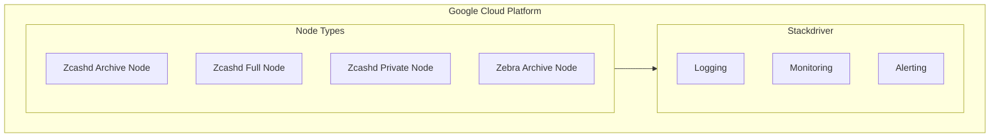

# System Patterns

## System Architecture

### Node Types
1. Zcashd Nodes
   - Archive Node: Full historical data retention
   - Full Node: Complete blockchain validation
   - Private Node: Enhanced privacy features

2. Zebra Nodes
   - Archive Node: Alternative implementation with full data retention

### Infrastructure Layout

## Key Technical Decisions

### 1. Infrastructure as Code
- Using Terraform/OpenTofu for infrastructure provisioning
- Modular design pattern for different node types
- Consistent resource naming and tagging conventions

### 2. Node Configuration
- Separate modules for different node types
- Standardized startup scripts for each node type
- Parameterized configuration through variables

### 3. Monitoring Strategy
- Integration with GCP Stackdriver
- Centralized logging architecture
- Standardized monitoring metrics

## Design Patterns

### 1. Module Structure
Each node type follows a consistent module pattern:
- `main.tf`: Core resource definitions
- `variables.tf`: Input parameters
- `outputs.tf`: Output values
- `startup.sh`: Node initialization script

### 2. Resource Organization
- Logical grouping by node type
- Consistent resource naming
- Clear dependency management

### 3. Configuration Management
- Variable-driven configuration
- Environment-specific settings
- Reusable module patterns

## Implementation Paths

### Node Deployment
1. Module selection based on node type
2. Resource provisioning via Terraform
3. Automated configuration via startup scripts
4. Monitoring integration

### Monitoring Setup
1. Stackdriver activation
2. Log aggregation configuration
3. Metric collection setup
4. Alert configuration

## Best Practices
1. Infrastructure Version Control
2. Consistent Resource Tagging
3. Module Reusability
4. Documentation Maintenance
5. Security-First Approach
